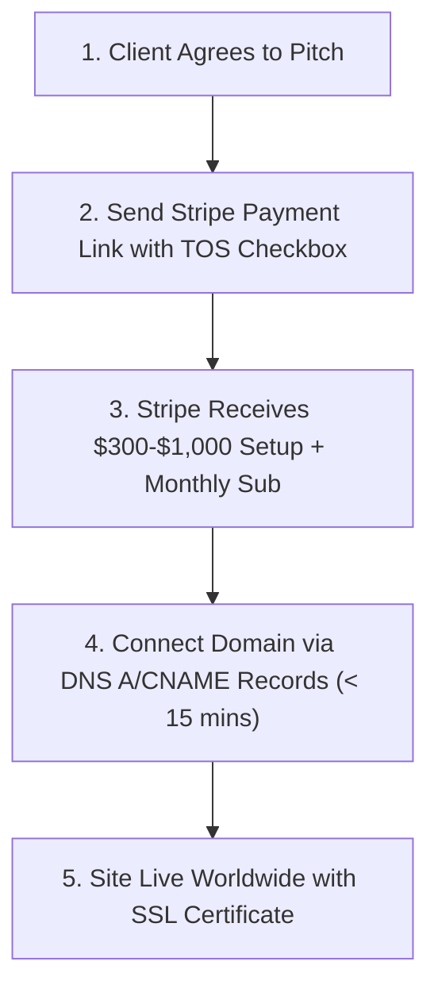

# Operations & Onboarding Playbook

This master playbook details the end-to-end operational workflow for **Dylan Roth Web Services LLC**, covering client onboarding SOPs, automated Stripe billing configuration, Vercel free hosting deployment, DNS domain cutover steps, client bi-monthly update handling, and technical platform features.

---

## ⚡ 4-Step Client Onboarding SOP (Checkout to Live Site)



---

## 💳 1. Automated Recurring Billing & Terms Setup in Stripe

Using Stripe Payment Links allows you to **collect payment AND execute a legally binding agreement in 1 single step**, with zero PDF back-and-forth:

1. **Log into Stripe Dashboard**: Go to [dashboard.stripe.com](https://dashboard.stripe.com).
2. **Configure Core Subscription Products**:
   * **Tier 1: Basic Web Package** -> $300.00 setup fee + $150.00 / month recurring.
   * **Tier 2: Standard Web Package** -> $500.00 setup fee + $300.00 / month recurring.
   * **Tier 3: Enterprise Web Package** -> $1,000.00 setup fee + $600.00 / month recurring.
3. **Configure High-Margin Add-On Products**:
   * **Add-On #1: Logo & Brand Modernization** -> $300.00 one-time payment.
   * **Add-On #2: Google Review & Local Reputation Booster** -> $100.00 / month recurring.
4. **Enable Terms of Service Checkbox**:
   * In your Stripe Payment Link settings, select **"Require customers to accept Terms of Service"**.
   * Link to your live Terms page: `https://dzor777.github.io/building-websites-for-local-businesses/?page=terms`.

---

## 🚀 2. Free High-Performance Hosting on Vercel

Hosting client sites on Vercel costs $0/month on the hobby/pro tier for static client sites while delivering 99.99% uptime and global CDN speed.

### Deployment Workflow:
1. **Push Repo to GitHub**:
   ```bash
   git init
   git add .
   git commit -m "Client website build"
   git push origin main
   ```
2. **Deploy on Vercel**:
   * Connect your GitHub account to Vercel.
   * Click **Add New Project** and select the repository.
   * Framework Preset: **Vite**.
   * Click **Deploy** (build takes < 40 seconds).

---

## 🛠️ 3. Domain Mapping & DNS Cutover SOP

When pointing a client's custom domain name (e.g. `bewleyplumbing.com`) to Vercel/GitHub Pages:

### Option A: Direct Client Instructions (Send Email #4)
Instruct the client to log into GoDaddy/Namecheap/Squarespace and update these 2 DNS records:
* **A Record**: Host `@` -> Points To `76.76.21.21`
* **CNAME Record**: Host `www` -> Points To `cname.vercel-dns.com`

### Option B: Delegate Access (Recommended for Speed)
Ask client to delegate temporary DNS manager access to `roth.dylan777@gmail.com`:
* **GoDaddy**: Account Settings -> Delegate Access -> Invite `roth.dylan777@gmail.com` (Products & DNS).
* **Namecheap / Squarespace**: Add `roth.dylan777@gmail.com` as manager.

Once updated, SSL certificates issue automatically and the client's new site goes live worldwide within 15 minutes!

---

## 🔄 4. Bi-Monthly & Quarterly Content Update SOP

Each subscription tier includes a scheduled quota for content updates (business hours, new service photos, pricing text, basic copy tweaks):
* **Tier 1 (Basic)**: Up to 4 quarterly updates per year.
* **Tier 2 (Standard)**: Up to 6 updates per year (1 update every 2 months).
* **Tier 3 (Enterprise)**: Monthly updates (12 updates per year).

### Update Workflow:
1. Client emails requested changes to `roth.dylan777@gmail.com`.
2. Open target client component or config file in workspace.
3. Edit content, save, and commit (`git push origin main`).
4. Site automatically updates worldwide via Vercel/GitHub Pages auto-deploy in under 60 seconds.
5. Send confirmation email to client: *"Your updates are live at {domain}!"*

---

## 🛠️ 5. Technical Platform Architecture & Tools

| Script | Purpose | Status |
| :--- | :--- | :--- |
| `scripts/view_leads.py` | CLI lead inspection, prospect searching, and email generator tool | Active |
| `scripts/update_campaign.py` | Synchronizes prospect dataset (`texas_leads.json`) | Active |
| `scripts/google_places_scraper.py` | Scrapes Google star ratings, reviews, and address details | Active |
| `scripts/site_parity_scraper.py` | Scrapes brand colors & services for zero brand downgrade | Active |
| `scripts/build_all_clients.py` | Generates client configs across trades & cities | Active |
